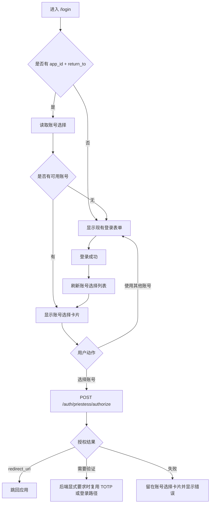

# Priestess 应用登录账号选择计划

## 目标

当第三方应用通过 Priestess 发起登录请求，也就是 `/login?app_id=...&return_to=...` 这类带授权上下文的入口时，如果当前浏览器里已经存在一个或多个可用 Priestess 本地账号，会话卡片不再先展示用户名、密码和 Passkey 登录表单，而是优先展示“选择账号继续”的界面。用户点选账号后再完成授权回跳；即使只有一个已登录账号，也必须由用户明确点击继续。只有没有可用账号，或者用户主动选择“使用其他账号”时，才回到现有登录表单。

这个计划只设计 Priestess 仓库内的前端和共享 API 契约，不在本次直接修改 Phainon 源码。需要后端配合的部分会写成兼容契约，后续实现生产能力时再按 Phainon Worker/Hono/D1 结构落地。

## 实施状态

更新时间：2026-05-24。

- 已完成 Priestess 仓库内的前端第一版：应用授权入口会优先读取账号选择，展示“选择账号”，不再对已登录会话做无感自动授权跳转。
- 已完成共享 API client 契约：`listLocalAccountChoices(params)`、`authorizeLocalSession({ choiceId })`、账号选择类型和 snake_case / camelCase normalizer。
- 已拆出 `authRequest` 纯函数、`useAuthAccountChoices` hook、`AccountPickerCard` 和独立 CSS，`App.tsx` 没有继续膨胀超过 1000 行。
- 已同步 `docs/phainon-qr-login-design.md`，记录 Phainon 后续需要实现的账号选择接口与授权扩展。
- 已补充可重复运行的最小 smoke：`npm run test:account-picker`，覆盖授权请求解析、账号选择卡片的 loading、empty、error、单账号、多账号、授权中状态，以及共享 API 的账号选择请求 query、snake_case / camelCase normalizer、带/不带 `choice_id` 的授权请求体。
- 已继续补强 hook 级回归：覆盖未来接口 404 / 501 时退回当前会话、未登录时进入 empty、后端缺少 `choice_id` 时显示契约错误、500 等真实后端错误不误降级。
- 已继续补强安全展示回归：`return_to` 只展示 http/https origin，非 Web scheme 不显示为可疑域名；头像只渲染 http/https 或同源绝对路径；账号选择卡片和 toast 会对后端误带出的 `login_code`、token、session、cookie、密码、私钥等字段值做脱敏。
- 已继续拆出账号授权辅助逻辑：`App.tsx` 只保留页面状态和跳转副作用，`choice_id` 缺失拦截、授权请求体构造、账号选择可见性状态组合由纯函数覆盖。
- 已继续补强长文本布局：超长 `app_id`、回跳域名、显示名、邮箱和错误文案都会在账号选择卡片内截断或断行，不再撑破移动端卡片。
- 已继续补强无障碍语义：账号行带有明确 `aria-label`，授权中的账号行会暴露 `aria-busy`，读屏器能识别正在使用哪个账号继续访问哪个应用。
- 已继续补强共享 API envelope 回归：账号选择响应支持顶层 `accounts`，也支持 Phainon 常见的 `{ data: { account_choices, client } }` 和嵌套 `user` 形状。
- 已通过 `npm run build:login`、`git diff --check` 和本地浏览器桌面/移动 smoke。
- 已验证当前 live backend 兼容降级：`GET /auth/priestess/account-choices` 暂未上线时返回 404，前端会继续读取 `GET /auth/priestess/session`；未登录状态下授权入口显示现有登录表单，不会空白或循环跳转。
- 尚未修改 Phainon 源码；正式多账号生产能力仍需要 Phainon 后端实现 `GET /auth/priestess/account-choices` 和带 `choice_id` 的授权校验。

## 逐步完成矩阵

| 步骤 | 状态 | 实现位置 | 验证 |
|---|---|---|---|
| 1. 共享 API 类型、normalizer、授权兼容 | 已完成 | `packages/priestess-shared/src/lib/priestessApi.ts` | `npm run test:account-picker` 覆盖 account-choices query、snake_case / camelCase normalizer、`data.account_choices` + `client` envelope、嵌套 `user`、带/不带 `choice_id` 的 authorize body |
| 2. 抽出 `authRequest` 纯函数 | 已完成 | `apps/login/src/lib/authRequest.ts` | `npm run test:account-picker` 覆盖无授权请求、缺少 `return_to`、完整授权请求、http/https origin 展示和非 Web scheme 隐藏 |
| 3. 新增 `useAuthAccountChoices` | 已完成 | `apps/login/src/lib/useAuthAccountChoices.ts` | `npm run test:account-picker` 覆盖 404 / 501 fallback、未登录 empty、缺 `choice_id` 契约错误、500 不误降级；Browser live fallback 验证未登录显示原表单 |
| 3.5. 拆出授权辅助逻辑 | 已完成 | `apps/login/src/lib/accountAuthorization.ts` | `npm run test:account-picker` 覆盖 `choice_id` 缺失拦截、旧 session fallback 不传 `choice_id`、新账号选择传 `choice_id`、loading / ready / error 可见、empty / idle / TOTP / 使用其他账号不可见 |
| 4. 新增 `AccountPickerCard` 与独立 CSS | 已完成 | `apps/login/src/components/AccountPickerCard.tsx`、`AccountPickerCard.css` | `npm run test:account-picker` 覆盖 loading、empty、error、单账号、多账号、授权中状态、账号行 `aria-label` / `aria-busy`、头像 URL 过滤和长文本渲染；Browser 验证移动端无横向溢出 |
| 5. 调整 `App.tsx` 渲染和授权分支 | 已完成 | `apps/login/src/App.tsx` | Browser smoke 覆盖普通 `/login`、授权入口账号选择、使用其他账号、选择账号后后端回跳 |
| 6. 同步 Phainon 契约文档 | 已完成 | `docs/phainon-qr-login-design.md` | 文档已记录 account-choices 接口和 `choice_id` 授权扩展 |
| 7. 补充最小测试 | 已完成 | `apps/login/scripts/account-picker-smoke.mjs` | `npm run test:account-picker` 覆盖 UI、共享 API、hook fallback 和敏感错误文案脱敏 |
| 8. 构建登录前端 | 已完成 | 登录 app workspace | `npm run build:login` 通过，仅有 Vite 大 chunk 提示 |
| 9. 桌面和移动浏览器验证 | 已完成 | 本地 `npm run dev:login` | Browser smoke 验证桌面/移动无横向溢出，live fallback 无空白或循环跳转 |

## 实施前状态

- `apps/login/src/App.tsx` 已经负责读取 `app_id`、`return_to`，并在有本地会话时直接调用 `authorizeLocalSession` 自动跳回应用。
- `apps/login/src/components/LoginForm.tsx` 是现有密码、Passkey 和 TOTP 登录卡片内容。
- `packages/priestess-shared/src/lib/priestessApi.ts` 已经有 `getLocalSession`、`loginLocalSession` 和 `authorizeLocalSession`，但 `getLocalSession` 只表达当前单一会话，无法稳定表示“这个浏览器里有多个可选账号”。
- `docs/phainon-qr-login-design.md` 是 Priestess 与 Phainon 登录契约的同步文档；新增授权选择接口时必须同步更新这里。
- `apps/login/src/App.tsx` 当前已经接近 1000 行，后续实现不能继续把大量账号选择逻辑塞进去，需要拆到小组件和小 hook。

## 目标行为

1. 普通访问 `/login` 时保持现有登录表单、注册入口、忘记密码、Passkey 和 QR 抽屉行为。
2. 应用访问 `/login?app_id=xxx&return_to=yyy` 时先检查当前浏览器是否有可用 Priestess 账号。
3. 如果没有可用账号，继续展示现有登录表单；登录成功后刷新账号选择列表，让用户明确选择账号后再授权回跳。
4. 如果有一个可用账号，登录卡片展示这个账号、目标应用信息、继续按钮和“使用其他账号”入口，不再自动无感跳转。
5. 如果有多个可用账号，登录卡片展示账号列表；用户选择其中一个账号后完成授权。
6. “使用其他账号”切回现有登录表单，用户可以密码登录、Passkey 登录或注册新账号；成功后保留原有账号，把新登录账号加入可选账号列表，再让用户明确选择账号继续授权。
7. 授权失败、账号过期、后端不可用时只显示清晰错误态，不把用户送进空白页或循环跳转。
8. 移动端保持单卡片布局；桌面端优先沿用当前登录卡片和 QR 抽屉结构，避免重做首屏架构。
9. 应用信息第一版只显示 `app_id` 和 `return_to` 的域名，不要求后端返回应用 logo 或应用展示名。
10. 账号选择后不额外强制 TOTP 或 Passkey step-up；如果未来需要高风险验证，应由后端风险策略显式返回 challenge 后再接入。

## API 契约计划

### 兼容优先的前端读取策略

第一版需要真实支持多个账号。前端仍保留兼容读取策略，避免多账号接口上线前完全不可用：

- 首选调用未来的账号选择接口，读取多个账号。
- 如果未来接口不存在或返回不支持，再退回 `getLocalSession`。
- `getLocalSession` 返回已认证用户时，前端把当前会话转换成一个账号选择项。
- `getLocalSession` 未认证时，前端进入现有登录表单。

这样可以在多账号后端能力就绪前先验证单账号选择体验；正式验收仍以多个账号能够同时出现在账号选择列表为准。

### 建议新增后端接口

建议在 Phainon 兼容后端增加：

```http
GET /auth/priestess/account-choices?app_id=...&return_to=...
```

返回：

```json
{
  "accounts": [
    {
      "choice_id": "short-lived-opaque-id",
      "user_id": "local-user-id",
      "username": "kurisu",
      "display_name": "KurisuRakko",
      "email": "y@rakko.cn",
      "avatar_url": "https://...",
      "current": true,
      "last_used_at": "2026-05-24T01:00:00.000Z",
      "expires_at": "2026-05-24T12:00:00.000Z"
    }
  ],
  "app": {
    "app_id": "example",
    "return_to_origin": "https://example.com"
  }
}
```

约束：

- `choice_id` 必须是短时、不可猜、只对当前浏览器授权上下文有效的 opaque id，不能直接使用用户 id 或裸 session id。
- 后端只返回未过期、未撤销、属于当前浏览器信任范围的账号。
- 第一版必须允许同一浏览器信任范围内保留多个账号选择项；用户通过“使用其他账号”完成新账号登录后，旧账号不能被前端主动移出列表。
- 邮箱、手机号等字段只返回用于 UI 展示的必要信息，不返回 token、cookie、session hash、refresh token 或完整 claims。
- `app_id` 和 `return_to` 仍由后端校验，不能只相信前端 URL。
- 第一版不要求返回应用 logo 或应用展示名；前端使用 `app_id` 和 `return_to_origin` 组合展示目标应用。

### 授权接口扩展

保留现有：

```http
POST /auth/priestess/authorize
```

现有请求体：

```json
{
  "app_id": "example",
  "return_to": "https://example.com/callback"
}
```

建议扩展为可选 `choice_id`：

```json
{
  "app_id": "example",
  "return_to": "https://example.com/callback",
  "choice_id": "short-lived-opaque-id"
}
```

规则：

- 不传 `choice_id` 时保持现有“当前本地会话授权”的语义。
- 传 `choice_id` 时，后端必须校验这个选择项来自同一授权请求、同一浏览器信任上下文且仍未过期。
- 如果账号需要重新验证或二步验证，后端返回明确错误码或 challenge，前端再复用现有 TOTP 或登录表单路径，不单独造一套特殊流程。
- 第一版账号选择本身不强制 step-up；不要在前端选择账号后主动要求 TOTP 或 Passkey。
- 返回值仍保持当前 `redirect_url` / `redirectUrl` 兼容形状，避免破坏现有 `authorizeLocalSession` 调用方。

## 前端结构计划

### 新增类型和 API client

修改 `packages/priestess-shared/src/lib/priestessApi.ts`：

- 新增 `LocalAccountChoice`、`LocalAccountChoiceApp`、`LocalAccountChoicesResult` 类型。
- 新增 `listLocalAccountChoices(params)`。
- 扩展 `authorizeLocalSession(params)`，允许可选 `choiceId`。
- normalizer 继续兼容 snake_case 和 camelCase。
- 在 `docs/phainon-qr-login-design.md` 同步新增账号选择与授权扩展说明。

### 新增登录页本地模块

为了避免 `App.tsx` 超过 1000 行，新增：

- `apps/login/src/lib/authRequest.ts`
  - 放 `AuthRequest` 类型、`readAuthRequest`、`getAuthRequestKey`、应用名 fallback 等纯函数。
- `apps/login/src/lib/useAuthAccountChoices.ts`
  - 封装账号选择读取、单会话 fallback、loading/error/ready/empty 状态。
  - 只在 `route === "login"` 且有 `authRequest` 时工作。
  - 使用 `AbortController` 防止路由切换后写入过期状态。
- `apps/login/src/components/AccountPickerCard.tsx`
  - 只负责展示账号列表、继续按钮、更多操作和错误态。
  - 不直接读 URL，不直接调用全局路由。
- `apps/login/src/components/AccountPickerCard.css`
  - 独立维护账号选择样式，避免继续扩大 `apps/login/src/styles.css`。

### `App.tsx` 调整点

- 移除“检测到已登录会话就自动授权跳转”的 effect。
- 在 `authMode === "login"`、存在 `authRequest` 且账号选择状态为 `ready` 时，把 `LoginForm` 替换成 `AccountPickerCard`。
- 账号选择状态为 `loading` 时，在同一个卡片内显示轻量 skeleton 或等待态。
- 账号选择状态为 `empty` 时继续显示现有 `LoginForm`。
- 用户点选账号时调用扩展后的 `authorizeLocalSession({ appId, returnTo, choiceId })`。
- 用户点“使用其他账号”时把账号选择面板临时收起，显示现有 `LoginForm`；登录成功后刷新账号选择列表，而不是直接回跳，也不清掉原有账号。
- 新账号登录成功后的文案应该提示“已添加账号，请选择要继续使用的账号”，避免用户误以为已经完成授权。
- 保留当前 QR session 刷新、轮询、登录成功 overlay、reduced motion、注册和忘记密码逻辑。

## UI 设计计划

视觉原则沿用当前 Priestess 登录页和 Yohaku 风格，不照搬示例图：

- 仍使用当前 `login-card` 的半透明表面、8px 圆角、细边框、轻阴影和现有字体层级。
- 标题建议为“选择账号”，副文案说明“继续访问 {appId}”，并在下一行或弱文本中显示 `return_to` 的域名。
- 账号行使用现有中性色与强调色：
  - 头像优先显示 `avatar_url`，没有头像时用显示名首字母或 Priestess mark。
  - 主文本显示 `display_name`，副文本显示 `username` 或 email。
  - 当前账号可显示小型状态文字“已登录”。
  - 行尾使用 lucide 图标按钮，例如 `MoreVertical` 或 `ArrowRight`，不要用粗重装饰。
- “使用其他账号”作为 secondary button 或 ghost row，复用现有按钮语义。
- 错误态使用当前 toast 加卡片内短文本，不弹出新的复杂 modal。
- 移动端账号行需要固定最小高度和文字截断，避免长邮箱撑破卡片。
- 不引入新的重型 UI 依赖，不使用大面积渐变或新的设计系统 token。

## 状态流



## 安全与隐私

- 不把账号列表、`choice_id`、`return_to` 或登录中间态写入 localStorage。
- 不在 URL、日志、toast 或错误详情里输出 token、cookie、session id、私钥、密码或一次性 code。
- 多账号选择必须由后端返回短时 `choice_id`，前端不拼接 session id。
- `return_to` 的合法性必须仍由后端校验。
- 如果后端暂时只支持单会话，前端只能展示当前会话，不做本地伪多账号。
- 正式多账号能力必须由后端维护同浏览器下的多个可选账号，前端不能用 localStorage 保存账号影子列表。
- 如果后续需要保存任何密钥或长期凭证，走 1Password CLI 或运行时环境变量，不进入仓库。

## 实施步骤

1. 新增共享 API 类型和 normalizer，并保持现有 `authorizeLocalSession` 调用兼容。
2. 抽出 `authRequest` 纯函数，降低 `App.tsx` 体积。
3. 新增 `useAuthAccountChoices`，实现多账号接口优先、当前 `getLocalSession` fallback 的读取策略。
4. 新增 `AccountPickerCard` 和独立 CSS，先覆盖单账号和多账号两种 UI。
5. 调整 `App.tsx` 渲染分支，把应用登录请求下的登录表单替换为账号选择卡片。
6. 更新 `docs/phainon-qr-login-design.md`，记录账号选择接口和授权扩展契约。
7. 补充或更新最小测试：
   - 无授权请求时仍显示现有登录表单。
   - 有授权请求且未登录时仍显示现有登录表单。
   - 有授权请求且已登录时显示账号选择，不自动跳转。
   - 只有一个账号时仍需要用户点击继续。
   - 多个账号时可以选择不同账号发起授权。
   - “使用其他账号”登录成功后刷新账号列表，并保留原有账号。
   - 点击账号后调用 authorize 并使用返回的 `redirectUrl`。
   - 点击“使用其他账号”回到现有登录表单。
8. 运行 `npm run build:login`。
9. 启动 `npm run dev:login`，用浏览器验证桌面和移动宽度：
   - `/login`
   - `/login?app_id=test&return_to=https%3A%2F%2Fexample.com%2Fcallback`
   - 账号选择 loading、ready、error、empty 状态

## 验收标准

- 已登录用户进入应用授权登录页时，不再看到默认用户名密码登录表单，也不会被无感自动跳走。
- 用户必须明确选择一个账号或选择“使用其他账号”。
- 只有一个已登录账号时也必须显式点击继续。
- “使用其他账号”登录成功后，原账号仍保留，新账号进入账号选择列表。
- 第一版应用信息只依赖 `app_id` 和 `return_to` 域名即可完整展示。
- 选择账号后仍由后端签发回跳地址，前端不自行拼接 `login_code`。
- 没有可用账号时，现有登录、注册、忘记密码、Passkey、TOTP 流程不回退。
- 桌面和移动布局没有文字溢出、按钮错位或卡片跳动。
- `App.tsx` 不因这次功能继续膨胀到难以维护；新增逻辑拆在小文件里。
- 不引入新的长期凭证或仓库内敏感信息。

## 非目标

- 本计划不重做 QR 登录流程。
- 本计划不把管理台业务面板引入登录前端。
- 本计划不修改 Phainon 源码，除非后续明确授权。
- 本计划不做本地 localStorage 伪多账号；多账号列表必须来自后端可信状态。
- 本计划不改变普通 `/manage` 个人中心路由语义。
- 本计划不在账号选择后主动追加 TOTP 或 Passkey step-up。

## 需要后续确认的点

- 多账号后端具体采用“同浏览器多本地 session”还是“账号选择凭据 + 必要时重新验证”的存储模型；但第一版产品行为必须支持多个账号同时出现在选择列表。
- 新账号登录后是否立即设为当前默认账号，还是仅加入选择列表并保持无默认选中；为了稳定，建议第一版无默认选中。
